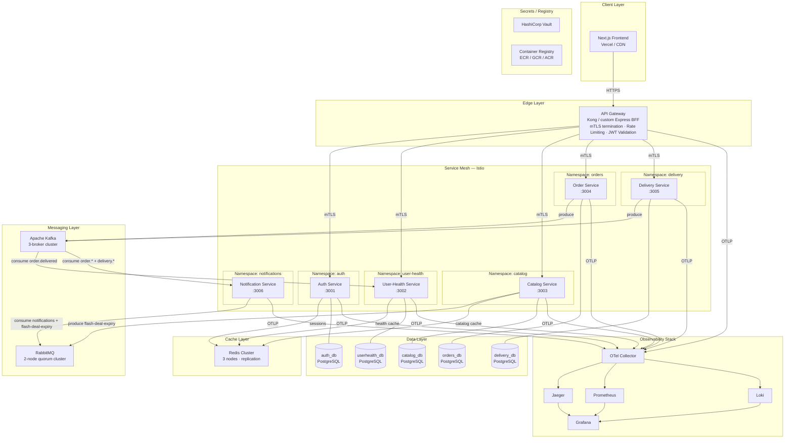

# Design Document — NutriEats V2 Production Architecture

## Overview

This document describes the complete production architecture for NutriEats V2, transforming the existing Express.js + PostgreSQL monolith into a cloud-native, event-driven, microservices platform. The architecture is designed for horizontal scalability, zero-trust security, full observability, and automated delivery.

All code examples use TypeScript, matching the existing project stack.

---

## System Architecture Diagram



---

## Microservices Boundaries and Communication Patterns

### Service Inventory

| Service | Port | Owns | Synchronous API | Async Producer | Async Consumer |
|---|---|---|---|---|---|
| **Auth Service** | 3001 | Users (auth), RefreshTokens, Sessions | REST: `/api/auth/*` | — | — |
| **User-Health Service** | 3002 | BodyStats, Allergy, NotifPrefs, DailyLog | REST: `/api/users/*` | — | Kafka `order.delivered` |
| **Catalog Service** | 3003 | Restaurant, MenuItem, deals, flash offers | REST: `/api/restaurants/*`, `/api/menu-items/*`, `/api/deals/*`, `/api/offers/flash` | RabbitMQ `flash-deal-expiry` | — |
| **Order Service** | 3004 | Order, OrderItem | REST: `/api/orders/*` | Kafka `order.*` | — |
| **Delivery Service** | 3005 | DeliveryAssignment, rider location | REST: `/api/rider/*` | Kafka `delivery.*` | — |
| **Notification Service** | 3006 | Notification records | — (no REST) | — | Kafka `order.*`, `delivery.*`; RabbitMQ `notifications`, `flash-deal-expiry` |
| **API Gateway** | 8080 | Routing, BFF, auth, rate limit | REST (all external routes) | — | — |

### Communication Patterns

**Synchronous (REST over mTLS):**
- All client → API Gateway requests use HTTPS.
- API Gateway → microservice calls use mTLS inside the service mesh.
- The BFF home-screen endpoint (`GET /api/bff/home`) fans out to Catalog Service and User-Health Service in parallel, using `Promise.all`, and assembles the response before returning.

**Asynchronous (Kafka — streaming):**
- Order lifecycle events flow `Order Service → Kafka → User-Health Service, Notification Service`.
- Delivery events flow `Delivery Service → Kafka → Notification Service`.
- Consumers use consumer groups for independent scaling.

**Asynchronous (RabbitMQ — task queues):**
- Flash deal expiry tasks: `Catalog Service → RabbitMQ exchange → Catalog Service consumer`.
- Notification dispatch: `Any service (via event fan-out) → notifications queue → Notification Service`.

**Cross-domain data access rule:**
No service connects to another service's database. All cross-domain reads go through REST APIs or event streams.

---

## Kafka Topic Topology and Event Schemas

### Topic Inventory

| Topic | Partitions | Replication Factor | Min ISR | Retention | Producer | Consumer(s) |
|---|---|---|---|---|---|---|
| `order.placed` | 6 | 3 | 2 | 7d | Order Service | Notification Service |
| `order.confirmed` | 6 | 3 | 2 | 7d | Order Service | Notification Service |
| `order.preparing` | 6 | 3 | 2 | 7d | Order Service | Notification Service |
| `order.out_for_delivery` | 6 | 3 | 2 | 7d | Order Service | Notification Service |
| `order.delivered` | 6 | 3 | 2 | 7d | Order Service | Notification Service, User-Health Service |
| `order.cancelled` | 6 | 3 | 2 | 7d | Order Service | Notification Service |
| `delivery.assigned` | 6 | 3 | 2 | 7d | Delivery Service | Notification Service |
| `delivery.picked_up` | 6 | 3 | 2 | 7d | Delivery Service | Notification Service |
| `delivery.on_the_way` | 6 | 3 | 2 | 7d | Delivery Service | Notification Service |
| `delivery.delivered` | 6 | 3 | 2 | 7d | Delivery Service | Notification Service |
| `order.placed.dlq` | 3 | 3 | 2 | 30d | Kafka DLQ router | Ops alerting |
| `order.delivered.dlq` | 3 | 3 | 2 | 30d | Kafka DLQ router | Ops alerting |
| *(same DLQ pattern for all topics)* | | | | | | |

### Partition Key Strategy

All order events use `orderId` as the partition key to ensure total ordering per order. All delivery events use `orderId` as the partition key for the same reason.

### Event Schemas (TypeScript)

```typescript
// Shared envelope for all Kafka events
interface KafkaEventEnvelope<T> {
  eventId: string;          // UUID v4
  eventType: string;        // e.g. "order.placed"
  occurredAt: string;       // ISO 8601
  traceId: string;          // W3C trace context propagation
  spanId: string;
  payload: T;
}

// order.placed
interface OrderPlacedPayload {
  orderId: string;
  customerId: string;
  restaurantId: string;
  totalPrice: number;
  totalCalories: number;
  items: Array<{
    menuItemId: string;
    quantity: number;
    priceSnapshot: number;
    caloriesSnapshot: number;
  }>;
  deliveryAddress: string;
  placedAt: string;         // ISO 8601
}

// order.delivered
interface OrderDeliveredPayload {
  orderId: string;
  customerId: string;
  deliveredAt: string;      // ISO 8601
  items: Array<{
    menuItemId: string;
    quantity: number;
    caloriesSnapshot: number;
  }>;
}

// delivery.assigned
interface DeliveryAssignedPayload {
  assignmentId: string;
  orderId: string;
  riderId: string;
  assignedAt: string;       // ISO 8601
}
```

### Dead-Letter Queue Handling

```typescript
// Kafka consumer with retry and DLQ
async function consumeWithRetry<T>(
  consumer: Kafka.Consumer,
  dlqProducer: Kafka.Producer,
  topic: string,
  handler: (payload: T) => Promise<void>,
  maxRetries = 3
): Promise<void> {
  await consumer.run({
    eachMessage: async ({ topic, message }) => {
      const attempts = parseInt(message.headers?.['x-retry-count']?.toString() ?? '0');
      try {
        await handler(JSON.parse(message.value!.toString()));
      } catch (err) {
        if (attempts >= maxRetries) {
          await dlqProducer.send({
            topic: `${topic}.dlq`,
            messages: [{
              key: message.key,
              value: message.value,
              headers: {
                ...message.headers,
                'x-failure-reason': String(err),
                'x-original-topic': topic,
                'x-failed-at': new Date().toISOString(),
              },
            }],
          });
          logger.error({ msg: 'Message moved to DLQ', topic, key: message.key?.toString(), error: String(err) });
        } else {
          // Requeue with incremented retry count
          await dlqProducer.send({
            topic,
            messages: [{
              key: message.key,
              value: message.value,
              headers: { ...message.headers, 'x-retry-count': String(attempts + 1) },
            }],
          });
        }
      }
    },
  });
}
```

---

## RabbitMQ Queue/Exchange Topology

### Exchange and Queue Declarations

```
EXCHANGES
─────────────────────────────────────────────────────────
nutrieats.notifications   (direct, durable)
nutrieats.flash-deals     (direct, durable)
nutrieats.dlx             (direct, durable)   ← dead-letter exchange

QUEUES
─────────────────────────────────────────────────────────
notifications             (quorum, durable)
  x-dead-letter-exchange: nutrieats.dlx
  x-dead-letter-routing-key: notifications.dlx
  x-message-ttl: 86400000 (24h)

flash-deal-expiry         (quorum, durable, delayed plugin)
  x-dead-letter-exchange: nutrieats.dlx
  x-dead-letter-routing-key: flash-deal-expiry.dlx
  x-delayed-type: direct

notifications.dlx         (quorum, durable)   ← DLQ for notifications
flash-deal-expiry.dlx     (quorum, durable)   ← DLQ for flash deals

BINDINGS
─────────────────────────────────────────────────────────
nutrieats.notifications  → notifications          (key: notify)
nutrieats.flash-deals    → flash-deal-expiry      (key: expire)
nutrieats.dlx            → notifications.dlx      (key: notifications.dlx)
nutrieats.dlx            → flash-deal-expiry.dlx  (key: flash-deal-expiry.dlx)
```

### Flash Deal Expiry Message Schema

```typescript
interface FlashDealExpiryMessage {
  menuItemId: string;
  restaurantId: string;
  expiresAt: string;     // ISO 8601
  traceId: string;
}
```

### Notification Task Schema

```typescript
interface NotificationTask {
  notificationId: string;
  recipientId: string;
  channel: 'in-app' | 'email' | 'push';
  templateId: string;
  variables: Record<string, string>;
  traceId: string;
}
```

---

## Redis Key Namespace and TTL Strategy

### Key Namespace Inventory

| Namespace Pattern | Owning Service | TTL | Invalidation Trigger |
|---|---|---|---|
| `session:refresh:{tokenId}` | Auth Service | Token `expiresAt` − `now()` | Refresh token revocation |
| `session:blocklist:{ip}` | Auth Service | 300 s | Auto-expiry |
| `catalog:restaurants:all` | Catalog Service | 300 s (5 min) | Any restaurant or menu item created/updated |
| `catalog:menu-item:{id}` | Catalog Service | 300 s (5 min) | MenuItem updated/created for this id |
| `catalog:restaurant:{id}:menu` | Catalog Service | 300 s (5 min) | Any menu item for this restaurant updated |
| `health:daily-log:{userId}:{date}` | User-Health Service | 60 s | DailyLog update after order.delivered |
| `health:rda:{userId}` | User-Health Service | 300 s | BodyStats or RDA override update |
| `health:allergies:{userId}` | User-Health Service | 600 s | Allergy add/remove |

### Cache Implementation Pattern

```typescript
// Generic cache-aside pattern used by all services
class CacheAsideService {
  constructor(
    private redis: Redis.Cluster,
    private logger: Logger,
  ) {}

  async get<T>(key: string, fallback: () => Promise<T>, ttlSeconds: number): Promise<T> {
    try {
      const cached = await this.redis.get(key);
      if (cached) return JSON.parse(cached) as T;
    } catch (err) {
      // Requirement 5.8: fallback to DB on Redis unavailability
      this.logger.warn({ msg: 'Redis unavailable, falling back to DB', key, error: String(err) });
    }
    const value = await fallback();
    try {
      await this.redis.setex(key, ttlSeconds, JSON.stringify(value));
    } catch (err) {
      this.logger.warn({ msg: 'Redis write failed, continuing without cache', key });
    }
    return value;
  }

  async invalidate(keys: string[]): Promise<void> {
    try {
      if (keys.length > 0) await this.redis.del(...keys);
    } catch (err) {
      this.logger.warn({ msg: 'Redis invalidation failed', keys });
    }
  }
}
```

### Redis Cluster Configuration

- 3 primary nodes, 3 replica nodes (1 replica per primary).
- `cluster-require-full-coverage: no` — cluster continues serving covered slots during partial failure.
- `maxmemory-policy: allkeys-lru` — evict least-recently-used keys when memory is full.
- TLS enabled on all cluster connections.

---

## API Gateway Routing Table

### Route Definitions

| Method | External Path | Upstream Service | Auth Required | Rate Limit | Notes |
|---|---|---|---|---|---|
| `POST` | `/api/auth/register` | Auth Service | No | 10/min per IP | Open endpoint |
| `POST` | `/api/auth/login` | Auth Service | No | 20/min per IP | Brute force protected in Auth Service |
| `POST` | `/api/auth/refresh` | Auth Service | Refresh token | 60/min per user | |
| `POST` | `/api/auth/logout` | Auth Service | Yes | 60/min per user | |
| `GET` | `/api/users/profile` | User-Health Service | Yes | 1000/min per user | |
| `POST` | `/api/users/body-stats` | User-Health Service | Yes | 60/min per user | |
| `GET` | `/api/users/daily-log` | User-Health Service | Yes | 1000/min per user | |
| `GET` | `/api/users/rda` | User-Health Service | Yes | 1000/min per user | |
| `PUT` | `/api/users/rda` | User-Health Service | Yes | 60/min per user | |
| `GET/POST` | `/api/users/allergies` | User-Health Service | Yes | 60/min per user | |
| `GET` | `/api/restaurants` | Catalog Service | Optional | 1000/min | Unauthenticated: 100/min per IP |
| `GET` | `/api/restaurants/:id` | Catalog Service | Optional | 1000/min | |
| `GET` | `/api/menu-items/:id` | Catalog Service | Optional | 1000/min | |
| `GET` | `/api/deals` | Catalog Service | Optional | 1000/min | |
| `GET` | `/api/offers/flash` | Catalog Service | Optional | 1000/min | |
| `POST/PUT/PATCH` | `/api/merchant/*` | Catalog Service | Yes (MERCHANT role) | 60/min per user | |
| `POST` | `/api/orders` | Order Service | Yes | 60/min per user | |
| `GET` | `/api/orders/:id` | Order Service | Yes | 1000/min per user | |
| `GET` | `/api/orders/my` | Order Service | Yes | 1000/min per user | |
| `PATCH` | `/api/orders/:id/status` | Order Service | Yes | 60/min per user | |
| `GET` | `/api/rider/assignments/*` | Delivery Service | Yes (RIDER role) | 1000/min per user | |
| `POST/PATCH` | `/api/rider/assignments/*` | Delivery Service | Yes (RIDER role) | 60/min per user | |
| `GET` | `/api/bff/home` | API Gateway (BFF) | Yes | 1000/min per user | Aggregates Catalog + User-Health |

### BFF Home Aggregation Logic

```typescript
// API Gateway BFF handler for home screen
async function bffHomeHandler(req: Request, res: Response) {
  const userId = req.user!.id;
  const today = new Date().toISOString().split('T')[0];

  const [deals, flashOffers, dailyLog, rda] = await Promise.all([
    catalogClient.get('/api/deals', { headers: traceHeaders(req) }),
    catalogClient.get('/api/offers/flash', { headers: traceHeaders(req) }),
    userHealthClient.get(`/api/users/daily-log?date=${today}`, { headers: withAuth(req) }),
    userHealthClient.get('/api/users/rda', { headers: withAuth(req) }),
  ]);

  res.json({
    deals: deals.data,
    flashOffers: flashOffers.data,
    dailyLog: dailyLog.data,
    rdaAlerts: computeHazards(dailyLog.data, rda.data),
  });
}
```

---

## Per-Service Database Schema Ownership

### Auth Service (`auth_db`)

Extracted from monolith — stores only authentication credentials. User profile data lives in `userhealth_db`.

```sql
-- auth_db schema
CREATE TABLE auth_users (
  id            VARCHAR(30) PRIMARY KEY,  -- cuid
  email         VARCHAR(255) UNIQUE NOT NULL,
  password_hash VARCHAR(255) NOT NULL,
  role          VARCHAR(20) NOT NULL DEFAULT 'CUSTOMER',
  created_at    TIMESTAMPTZ NOT NULL DEFAULT NOW(),
  updated_at    TIMESTAMPTZ NOT NULL DEFAULT NOW()
);

CREATE TABLE refresh_tokens (
  id         VARCHAR(30) PRIMARY KEY,
  user_id    VARCHAR(30) NOT NULL REFERENCES auth_users(id) ON DELETE CASCADE,
  token_hash VARCHAR(255) NOT NULL,
  expires_at TIMESTAMPTZ NOT NULL,
  revoked    BOOLEAN NOT NULL DEFAULT FALSE,
  created_at TIMESTAMPTZ NOT NULL DEFAULT NOW()
);
CREATE INDEX idx_refresh_tokens_user_id ON refresh_tokens(user_id);
CREATE INDEX idx_refresh_tokens_expires_at ON refresh_tokens(expires_at);
```

### User-Health Service (`userhealth_db`)

```sql
-- userhealth_db schema
CREATE TABLE users (
  id         VARCHAR(30) PRIMARY KEY,
  name       VARCHAR(255) NOT NULL,
  email      VARCHAR(255) UNIQUE NOT NULL,  -- denormalized read copy
  phone      VARCHAR(30),
  role       VARCHAR(20) NOT NULL,
  created_at TIMESTAMPTZ NOT NULL DEFAULT NOW()
);

CREATE TABLE body_stats (
  id             VARCHAR(30) PRIMARY KEY,
  user_id        VARCHAR(30) UNIQUE NOT NULL REFERENCES users(id) ON DELETE CASCADE,
  age            INT NOT NULL,
  weight_kg      NUMERIC(6,2) NOT NULL,
  height_cm      NUMERIC(6,2) NOT NULL,
  gender         VARCHAR(10) NOT NULL,
  activity_level VARCHAR(30) NOT NULL,
  bmr            NUMERIC(10,4) NOT NULL,
  rda_calories   NUMERIC(10,4) NOT NULL,
  rda_protein    NUMERIC(10,4) NOT NULL,
  rda_carbs      NUMERIC(10,4) NOT NULL,
  rda_fat        NUMERIC(10,4) NOT NULL,
  rda_fiber      NUMERIC(10,4) NOT NULL,
  updated_at     TIMESTAMPTZ NOT NULL DEFAULT NOW()
);

CREATE TABLE allergies (
  id            VARCHAR(30) PRIMARY KEY,
  user_id       VARCHAR(30) NOT NULL REFERENCES users(id) ON DELETE CASCADE,
  allergen_name VARCHAR(100) NOT NULL,
  UNIQUE(user_id, allergen_name)
);

CREATE TABLE notif_prefs (
  id                 VARCHAR(30) PRIMARY KEY,
  user_id            VARCHAR(30) UNIQUE NOT NULL REFERENCES users(id) ON DELETE CASCADE,
  low_calories_alert BOOLEAN NOT NULL DEFAULT TRUE,
  low_protein_alert  BOOLEAN NOT NULL DEFAULT TRUE,
  low_carbs_alert    BOOLEAN NOT NULL DEFAULT TRUE,
  low_fat_alert      BOOLEAN NOT NULL DEFAULT FALSE,
  low_fiber_alert    BOOLEAN NOT NULL DEFAULT TRUE
);

CREATE TABLE daily_logs (
  id                VARCHAR(30) PRIMARY KEY,
  user_id           VARCHAR(30) NOT NULL REFERENCES users(id) ON DELETE CASCADE,
  date              DATE NOT NULL,
  calories_consumed NUMERIC(10,4) NOT NULL DEFAULT 0,
  protein_consumed  NUMERIC(10,4) NOT NULL DEFAULT 0,
  carbs_consumed    NUMERIC(10,4) NOT NULL DEFAULT 0,
  fat_consumed      NUMERIC(10,4) NOT NULL DEFAULT 0,
  fiber_consumed    NUMERIC(10,4) NOT NULL DEFAULT 0,
  updated_at        TIMESTAMPTZ NOT NULL DEFAULT NOW(),
  UNIQUE(user_id, date)
);
CREATE INDEX idx_daily_logs_user_date ON daily_logs(user_id, date);
```

### Catalog Service (`catalog_db`)

```sql
-- catalog_db schema
CREATE TABLE restaurants (
  id           VARCHAR(30) PRIMARY KEY,
  owner_id     VARCHAR(30) UNIQUE NOT NULL,   -- FK to auth_db user id (no join)
  name         VARCHAR(255) NOT NULL,
  address      TEXT NOT NULL,
  cuisine_tags TEXT[] NOT NULL DEFAULT '{}',
  health_score NUMERIC(4,2) NOT NULL DEFAULT 5.0,
  is_open      BOOLEAN NOT NULL DEFAULT TRUE,
  created_at   TIMESTAMPTZ NOT NULL DEFAULT NOW()
);

CREATE TABLE menu_items (
  id               VARCHAR(30) PRIMARY KEY,
  restaurant_id    VARCHAR(30) NOT NULL REFERENCES restaurants(id) ON DELETE CASCADE,
  name             VARCHAR(255) NOT NULL,
  description      TEXT NOT NULL DEFAULT '',
  price            NUMERIC(10,2) NOT NULL,
  image_url        TEXT NOT NULL DEFAULT '',
  calories         NUMERIC(10,4) NOT NULL,
  protein          NUMERIC(10,4) NOT NULL,
  carbs            NUMERIC(10,4) NOT NULL,
  fat              NUMERIC(10,4) NOT NULL,
  fiber            NUMERIC(10,4) NOT NULL,
  cooking_method   TEXT NOT NULL DEFAULT '',
  ingredients      JSONB NOT NULL DEFAULT '[]',
  allergens        TEXT[] NOT NULL DEFAULT '{}',
  health_score     NUMERIC(4,2) NOT NULL DEFAULT 5.0,
  is_healthy       BOOLEAN NOT NULL DEFAULT FALSE,
  is_available     BOOLEAN NOT NULL DEFAULT TRUE,
  discount         NUMERIC(5,2) NOT NULL DEFAULT 0,
  flash_deal_until TIMESTAMPTZ,
  created_at       TIMESTAMPTZ NOT NULL DEFAULT NOW()
);
CREATE INDEX idx_menu_items_restaurant ON menu_items(restaurant_id);
CREATE INDEX idx_menu_items_flash_deal ON menu_items(flash_deal_until) WHERE flash_deal_until IS NOT NULL;
```

### Order Service (`orders_db`)

```sql
-- orders_db schema
CREATE TABLE orders (
  id               VARCHAR(30) PRIMARY KEY,
  customer_id      VARCHAR(30) NOT NULL,   -- no FK; cross-domain reference
  restaurant_id    VARCHAR(30) NOT NULL,   -- no FK; cross-domain reference
  status           VARCHAR(30) NOT NULL DEFAULT 'PLACED',
  total_price      NUMERIC(10,2) NOT NULL,
  total_calories   NUMERIC(10,4) NOT NULL,
  delivery_address TEXT NOT NULL,
  version          INT NOT NULL DEFAULT 0, -- optimistic lock column
  created_at       TIMESTAMPTZ NOT NULL DEFAULT NOW(),
  updated_at       TIMESTAMPTZ NOT NULL DEFAULT NOW()
);
CREATE INDEX idx_orders_customer ON orders(customer_id);
CREATE INDEX idx_orders_status   ON orders(status);

CREATE TABLE order_items (
  id                VARCHAR(30) PRIMARY KEY,
  order_id          VARCHAR(30) NOT NULL REFERENCES orders(id) ON DELETE CASCADE,
  menu_item_id      VARCHAR(30) NOT NULL,  -- no FK; cross-domain snapshot
  quantity          INT NOT NULL,
  price_snapshot    NUMERIC(10,2) NOT NULL,
  calories_snapshot NUMERIC(10,4) NOT NULL
);
CREATE INDEX idx_order_items_order ON order_items(order_id);
```

### Delivery Service (`delivery_db`)

```sql
-- delivery_db schema
CREATE TABLE delivery_assignments (
  id           VARCHAR(30) PRIMARY KEY,
  order_id     VARCHAR(30) UNIQUE NOT NULL,
  rider_id     VARCHAR(30) NOT NULL,       -- no FK; cross-domain reference
  status       VARCHAR(30) NOT NULL DEFAULT 'ASSIGNED',
  picked_up_at TIMESTAMPTZ,
  delivered_at TIMESTAMPTZ,
  created_at   TIMESTAMPTZ NOT NULL DEFAULT NOW()
);
CREATE INDEX idx_delivery_rider ON delivery_assignments(rider_id);
CREATE INDEX idx_delivery_order ON delivery_assignments(order_id);

-- Rider location tracking (append-only for audit trail)
CREATE TABLE rider_locations (
  id           BIGSERIAL PRIMARY KEY,
  rider_id     VARCHAR(30) NOT NULL,
  latitude     NUMERIC(10, 7) NOT NULL,
  longitude    NUMERIC(10, 7) NOT NULL,
  recorded_at  TIMESTAMPTZ NOT NULL DEFAULT NOW()
);
CREATE INDEX idx_rider_locations_rider ON rider_locations(rider_id, recorded_at DESC);
```

---

## Kubernetes Cluster Topology

### Cluster Layout (EKS/GKE/AKS)

```
Cluster: nutrieats-prod
├── Node Pool: system
│     machine: e2-standard-2 (2 vCPU, 8 GiB)  ×2
│     taint: CriticalAddonsOnly=true:NoSchedule
│     hosts: CoreDNS, metrics-server, cluster-autoscaler, Istio control plane
│
├── Node Pool: app
│     machine: e2-standard-4 (4 vCPU, 16 GiB)  ×3 (min) – 20 (max)
│     hosts: all six microservices + API Gateway
│
├── Node Pool: data
│     machine: e2-highmem-4 (4 vCPU, 32 GiB)  ×3
│     taint: workload=data:NoSchedule
│     toleration required for: Kafka, RabbitMQ, Redis
│
└── Node Pool: observability
      machine: e2-standard-4 (4 vCPU, 16 GiB)  ×2
      taint: workload=observability:NoSchedule
      hosts: Prometheus, Jaeger, Loki, Grafana, OTel Collector

NAMESPACES
├── istio-system        ← service mesh control plane
├── cert-manager        ← certificate automation
├── api-gateway         ← API Gateway / BFF
├── auth                ← Auth Service
├── user-health         ← User-Health Service
├── catalog             ← Catalog Service
├── orders              ← Order Service
├── delivery            ← Delivery Service
├── notifications       ← Notification Service
├── kafka               ← Kafka cluster (Strimzi operator)
├── rabbitmq            ← RabbitMQ cluster (RabbitMQ operator)
├── redis               ← Redis cluster (Redis Operator)
├── databases           ← PostgreSQL clusters (CloudNativePG operator)
├── observability       ← Prometheus, Jaeger, Loki, Grafana, OTel Collector
└── vault               ← HashiCorp Vault
```

### Pod Anti-Affinity Example (Kubernetes Deployment manifest)

```yaml
affinity:
  podAntiAffinity:
    requiredDuringSchedulingIgnoredDuringExecution:
      - labelSelector:
          matchLabels:
            app: order-service
        topologyKey: kubernetes.io/hostname
```

### HPA Configuration (per service)

```yaml
apiVersion: autoscaling/v2
kind: HorizontalPodAutoscaler
metadata:
  name: order-service-hpa
  namespace: orders
spec:
  scaleTargetRef:
    apiVersion: apps/v1
    kind: Deployment
    name: order-service
  minReplicas: 2
  maxReplicas: 20
  metrics:
    - type: Resource
      resource:
        name: cpu
        target:
          type: Utilization
          averageUtilization: 70
```

### Resource Requests and Limits (all services)

```yaml
resources:
  requests:
    cpu: "100m"
    memory: "128Mi"
  limits:
    cpu: "1000m"
    memory: "512Mi"
```

---

## Helm Chart Structure

```
helm/
├── charts/
│   ├── api-gateway/
│   │   ├── Chart.yaml
│   │   ├── values.yaml
│   │   ├── values-dev.yaml
│   │   ├── values-staging.yaml
│   │   ├── values-production.yaml
│   │   └── templates/
│   │       ├── deployment.yaml
│   │       ├── service.yaml
│   │       ├── ingress.yaml
│   │       ├── hpa.yaml
│   │       ├── pdb.yaml
│   │       ├── networkpolicy.yaml
│   │       ├── serviceaccount.yaml
│   │       └── configmap.yaml
│   ├── auth-service/          ← same template structure as api-gateway
│   ├── user-health-service/
│   ├── catalog-service/
│   ├── order-service/
│   ├── delivery-service/
│   ├── notification-service/
│   └── infra/
│       ├── kafka/             ← Strimzi Kafka CR wrapper
│       ├── rabbitmq/          ← RabbitMQ operator CR wrapper
│       ├── redis/             ← Redis operator CR wrapper
│       └── postgresql/        ← CloudNativePG cluster CR wrapper
└── umbrella/
    ├── Chart.yaml
    ├── values.yaml
    └── charts/                ← symlinks or dependencies to service charts
```

### Key values.yaml Pattern

```yaml
# helm/charts/order-service/values.yaml
replicaCount: 2

image:
  repository: ""  # set in CI via --set
  tag: ""
  pullPolicy: IfNotPresent

service:
  port: 3004

resources:
  requests:
    cpu: 100m
    memory: 128Mi
  limits:
    cpu: 1000m
    memory: 512Mi

autoscaling:
  enabled: true
  minReplicas: 2
  maxReplicas: 20
  targetCPUUtilizationPercentage: 70

probes:
  liveness:
    path: /health/live
    initialDelaySeconds: 15
    periodSeconds: 20
  readiness:
    path: /health/ready
    initialDelaySeconds: 10
    periodSeconds: 10

terminationGracePeriodSeconds: 60

env: {}          # populated by SOPS-decrypted values in CI
secrets: {}      # injected from Vault at pod startup via init container
```

### SOPS Encryption Workflow

All sensitive values in `values-production.yaml` (database passwords, JWT signing keys, Kafka credentials) are encrypted using SOPS with an AWS KMS or GCP KMS master key. The CI/CD pipeline decrypts them at deploy time:

```bash
# CI pipeline step
sops --decrypt helm/charts/auth-service/values-production.yaml \
  | helm upgrade --install auth-service ./helm/charts/auth-service \
    --namespace auth \
    --values - \
    --atomic --timeout 5m
```

---

## CI/CD Pipeline Stages

### GitHub Actions Pipeline

```
Trigger: PR open / push to main
│
├─ Stage 1: Lint & Type Check (parallel per changed service)
│   ├── eslint --max-warnings 0
│   ├── tsc --noEmit
│   └── prisma validate (for services with Prisma)
│
├─ Stage 2: Unit Tests + PBT (parallel per changed service)
│   ├── vitest run --coverage
│   └── PBT suite (fast-check, min 1000 cases, seed recorded in output)
│
├─ Stage 3: Integration Tests (parallel per changed service)
│   ├── Spin up service + dependencies via docker-compose
│   └── Run integration test suite
│
├─ Stage 4: Docker Build (parallel per changed service)
│   ├── docker buildx build --platform linux/amd64
│   ├── Tag: {registry}/{service}:{commit-sha}
│   └── Push to container registry
│
├─ Stage 5: Security Scan (parallel per changed service)
│   ├── trivy image --severity CRITICAL --exit-code 1 {image}
│   └── Block pipeline on critical CVE
│
├─ Stage 6: Deploy to Staging [main branch only]
│   ├── sops decrypt secrets
│   ├── helm upgrade --atomic --timeout 5m (per changed service)
│   └── Run smoke test suite against staging API Gateway
│
├─ Stage 7: Manual Approval Gate [main branch only]
│   └── Requires approval from on-call engineer in GitHub
│
└─ Stage 8: Deploy to Production [after approval]
    ├── sops decrypt secrets
    ├── helm upgrade --atomic --timeout 5m (per changed service)
    ├── Run production smoke tests (read-only)
    └── On failure: helm rollback + notify on-call channel (Slack/PagerDuty)
```

### Caching Strategy

```yaml
# .github/workflows/ci.yml — cache configuration
- uses: actions/cache@v4
  with:
    path: |
      ~/.npm
      **/node_modules
      /tmp/.buildx-cache
    key: ${{ runner.os }}-${{ hashFiles('**/package-lock.json') }}-${{ github.sha }}
    restore-keys: |
      ${{ runner.os }}-${{ hashFiles('**/package-lock.json') }}-
      ${{ runner.os }}-
```

### Database Migration in CI/CD

```yaml
# Kubernetes Job — runs BEFORE new pods start
apiVersion: batch/v1
kind: Job
metadata:
  name: order-service-migration-{{ .Release.Revision }}
  namespace: orders
  annotations:
    "helm.sh/hook": pre-upgrade,pre-install
    "helm.sh/hook-delete-policy": hook-succeeded
spec:
  template:
    spec:
      containers:
        - name: migrate
          image: "{{ .Values.image.repository }}:{{ .Values.image.tag }}"
          command: ["npx", "prisma", "migrate", "deploy"]
          env:
            - name: DATABASE_URL
              valueFrom:
                secretKeyRef:
                  name: order-service-secrets
                  key: DATABASE_URL
      restartPolicy: Never
  backoffLimit: 0
```

---

## Observability Stack

### Architecture

```
All Services (HTTP/gRPC)
       │
       ▼
OpenTelemetry SDK (traces + metrics + logs)
       │
       ├──── OTLP/gRPC ──▶ OTel Collector (DaemonSet on each node)
       │                          │
       │              ┌───────────┼──────────────┐
       │              ▼           ▼               ▼
       │           Jaeger      Prometheus      Loki
       │           (traces)    (metrics)       (logs)
       │                          │               │
       └──────────────────────────┴───────────────┘
                                  ▼
                               Grafana
                          (unified dashboards)
```

### OpenTelemetry SDK Initialization (shared library)

```typescript
// packages/observability/src/index.ts
import { NodeSDK } from '@opentelemetry/sdk-node';
import { OTLPTraceExporter } from '@opentelemetry/exporter-trace-otlp-grpc';
import { OTLPMetricExporter } from '@opentelemetry/exporter-metrics-otlp-grpc';
import { PrometheusExporter } from '@opentelemetry/exporter-prometheus';
import { Resource } from '@opentelemetry/resources';
import { SEMRESATTRS_SERVICE_NAME, SEMRESATTRS_SERVICE_VERSION } from '@opentelemetry/semantic-conventions';

export function initTelemetry(serviceName: string, serviceVersion: string) {
  const sdk = new NodeSDK({
    resource: new Resource({
      [SEMRESATTRS_SERVICE_NAME]: serviceName,
      [SEMRESATTRS_SERVICE_VERSION]: serviceVersion,
    }),
    traceExporter: new OTLPTraceExporter({
      url: process.env.OTEL_EXPORTER_OTLP_ENDPOINT ?? 'http://otel-collector:4317',
    }),
    metricReader: new PrometheusExporter({ port: 9464 }), // scraped by Prometheus
  });
  sdk.start();
  process.on('SIGTERM', () => sdk.shutdown());
}
```

### Structured Logger (shared)

```typescript
// packages/observability/src/logger.ts
import pino from 'pino';
import { context, trace } from '@opentelemetry/api';

export function createLogger(service: string) {
  return pino({
    base: { service },
    timestamp: () => `,"timestamp":"${new Date().toISOString()}"`,
    formatters: {
      log(obj) {
        const span = trace.getActiveSpan();
        if (span) {
          const ctx = span.spanContext();
          return { ...obj, traceId: ctx.traceId, spanId: ctx.spanId };
        }
        return obj;
      },
    },
  });
}
// Emits: { timestamp, level, service, traceId, spanId, message, context? }
```

### Custom Prometheus Metrics (per service)

```typescript
// packages/observability/src/metrics.ts
import { metrics } from '@opentelemetry/api';

const meter = metrics.getMeter('nutrieats');

export const httpRequestCount = meter.createCounter('http_requests_total', {
  description: 'Total HTTP requests',
});

export const httpRequestDuration = meter.createHistogram('http_request_duration_seconds', {
  description: 'HTTP request duration in seconds',
  boundaries: [0.005, 0.01, 0.025, 0.05, 0.1, 0.25, 0.5, 1, 2.5],
});

export const kafkaConsumerLag = meter.createObservableGauge('kafka_consumer_lag', {
  description: 'Kafka consumer lag per topic-partition',
});

export const rabbitmqQueueDepth = meter.createObservableGauge('rabbitmq_queue_depth', {
  description: 'RabbitMQ queue depth per queue',
});

export const redisCommandDuration = meter.createHistogram('redis_command_duration_seconds', {
  description: 'Redis command duration in seconds',
});
```

### Prometheus Alert Rules

```yaml
# alerting-rules.yaml
groups:
  - name: nutrieats.slo
    rules:
      - alert: HighErrorRate
        expr: |
          sum(rate(http_requests_total{status=~"5.."}[5m])) by (service)
          /
          sum(rate(http_requests_total[5m])) by (service)
          > 0.01
        for: 5m
        labels:
          severity: critical
        annotations:
          summary: "Error rate > 1% for {{ $labels.service }}"

      - alert: HighP99Latency
        expr: |
          histogram_quantile(0.99, rate(http_request_duration_seconds_bucket[5m])) > 0.5
        for: 5m
        labels:
          severity: warning
        annotations:
          summary: "p99 latency > 500ms for {{ $labels.service }}"
```

### Grafana Dashboard Inventory

| Dashboard | Datasource | Key Panels |
|---|---|---|
| Platform Overview | Prometheus | Request rate, error rate, p99 per service |
| Kafka | Prometheus | Consumer lag per topic-partition, produce rate |
| RabbitMQ | Prometheus | Queue depth, publish rate, DLX routing rate |
| Redis | Prometheus | Hit rate, miss rate, command duration p99 |
| Logs Explorer | Loki | Full-text log search, filter by traceId |
| Traces | Jaeger (via Grafana) | Trace timeline, service dependency graph |

---

## Security Architecture

### mTLS and Service Mesh (Istio)

All inter-service communication within the cluster runs over mTLS enforced by Istio. The control plane (istiod) issues and rotates certificates automatically every 24 hours via SPIFFE/SPIRE.

```yaml
# PeerAuthentication — enforce mTLS cluster-wide
apiVersion: security.istio.io/v1beta1
kind: PeerAuthentication
metadata:
  name: default
  namespace: istio-system
spec:
  mtls:
    mode: STRICT

# AuthorizationPolicy — deny-by-default, per namespace example
apiVersion: security.istio.io/v1beta1
kind: AuthorizationPolicy
metadata:
  name: deny-all
  namespace: orders
spec: {}  # empty spec = deny all

---
# Permit only API Gateway to call Order Service
apiVersion: security.istio.io/v1beta1
kind: AuthorizationPolicy
metadata:
  name: allow-api-gateway
  namespace: orders
spec:
  selector:
    matchLabels:
      app: order-service
  action: ALLOW
  rules:
    - from:
        - source:
            principals: ["cluster.local/ns/api-gateway/sa/api-gateway"]
```

### Kubernetes NetworkPolicies (example — orders namespace)

```yaml
apiVersion: networking.k8s.io/v1
kind: NetworkPolicy
metadata:
  name: orders-ingress
  namespace: orders
spec:
  podSelector:
    matchLabels:
      app: order-service
  policyTypes:
    - Ingress
    - Egress
  ingress:
    - from:
        - namespaceSelector:
            matchLabels:
              kubernetes.io/metadata.name: api-gateway
      ports:
        - protocol: TCP
          port: 3004
  egress:
    - to:
        - namespaceSelector:
            matchLabels:
              kubernetes.io/metadata.name: databases
      ports:
        - protocol: TCP
          port: 5432
    - to:
        - namespaceSelector:
            matchLabels:
              kubernetes.io/metadata.name: kafka
      ports:
        - protocol: TCP
          port: 9092
    - to:
        - namespaceSelector:
            matchLabels:
              kubernetes.io/metadata.name: redis
      ports:
        - protocol: TCP
          port: 6379
```

### JWT Configuration (Auth Service)

```typescript
// Auth Service — JWT issuance
import * as jwt from 'jsonwebtoken';

const ACCESS_TOKEN_TTL_SECONDS = 900;   // 15 minutes (Req 9.2)
const REFRESH_TOKEN_TTL_SECONDS = 2592000; // 30 days

function issueAccessToken(userId: string, role: string, privateKey: string): string {
  return jwt.sign(
    { sub: userId, role },
    privateKey,
    {
      algorithm: 'RS256',           // 2048-bit RSA minimum (Req 9.2)
      expiresIn: ACCESS_TOKEN_TTL_SECONDS,
      issuer: 'nutrieats-auth',
      audience: 'nutrieats-api',
    }
  );
}
```

### Brute Force Protection (Auth Service)

```typescript
// Redis-backed IP block on 5 failures within 60 seconds
async function recordFailedAttempt(ip: string, redis: Redis): Promise<boolean> {
  const key = `session:blocklist:${ip}`;
  const count = await redis.incr(key);
  if (count === 1) await redis.expire(key, 60);
  if (count >= 5) {
    await redis.setex(key, 300, 'blocked');
    logger.warn({ msg: 'IP blocked for brute force', ip, level: 'warn' });
    return true;
  }
  return false;
}
```

### Secrets Management Flow

```
HashiCorp Vault (root of trust)
    │
    ├── Vault Agent Injector (Kubernetes mutating webhook)
    │       injects secrets as files or env vars at pod startup
    │
    ├── Secret rotation: every 90 days (automated via Vault leases)
    │
    └── SOPS (for Helm values committed to git)
            ← encrypted with KMS master key
            ← decrypted in CI only
```

---

## Monorepo Folder / Repository Structure

```
nutrieats/
├── .github/
│   └── workflows/
│       ├── ci.yml               # PR checks (lint, test, build, scan)
│       └── deploy.yml           # Deploy to staging + production
│
├── packages/                    # Shared internal libraries
│   ├── observability/           # OTel init, structured logger, metrics
│   ├── kafka-client/            # Typed Kafka producer/consumer wrappers
│   ├── rabbitmq-client/         # Typed RabbitMQ producer/consumer wrappers
│   ├── redis-client/            # Cache-aside wrapper
│   ├── auth-middleware/         # JWT validation middleware (shared)
│   └── types/                   # Shared TypeScript types and event schemas
│
├── services/
│   ├── api-gateway/
│   │   ├── Dockerfile
│   │   ├── package.json
│   │   └── src/
│   │       ├── routes/          # Route definitions and proxy logic
│   │       ├── bff/             # BFF aggregation handlers
│   │       ├── middleware/      # Auth, rate-limit, trace propagation
│   │       └── index.ts
│   │
│   ├── auth-service/
│   │   ├── Dockerfile
│   │   ├── package.json
│   │   └── src/
│   │       ├── routes/
│   │       ├── controllers/
│   │       ├── services/        # JWT, token rotation, brute force
│   │       ├── db/              # Prisma client + auth_db schema
│   │       └── index.ts
│   │
│   ├── user-health-service/
│   │   ├── Dockerfile
│   │   ├── package.json
│   │   └── src/
│   │       ├── routes/
│   │       ├── controllers/
│   │       ├── services/        # BMR calc, RDA computation, daily log
│   │       ├── consumers/       # Kafka order.delivered consumer
│   │       ├── db/              # Prisma client + userhealth_db schema
│   │       └── index.ts
│   │
│   ├── catalog-service/
│   │   ├── Dockerfile
│   │   ├── package.json
│   │   └── src/
│   │       ├── routes/
│   │       ├── controllers/
│   │       ├── services/        # Health score, deal management
│   │       ├── producers/       # RabbitMQ flash-deal-expiry publisher
│   │       ├── consumers/       # RabbitMQ flash-deal-expiry processor
│   │       ├── db/              # Prisma client + catalog_db schema
│   │       └── index.ts
│   │
│   ├── order-service/
│   │   ├── Dockerfile
│   │   ├── package.json
│   │   └── src/
│   │       ├── routes/
│   │       ├── controllers/
│   │       ├── services/        # Order state machine, optimistic locking
│   │       ├── producers/       # Kafka order.* publisher
│   │       ├── db/              # Prisma client + orders_db schema
│   │       └── index.ts
│   │
│   ├── delivery-service/
│   │   ├── Dockerfile
│   │   ├── package.json
│   │   └── src/
│   │       ├── routes/
│   │       ├── controllers/
│   │       ├── services/        # Assignment logic, location tracking
│   │       ├── producers/       # Kafka delivery.* publisher
│   │       ├── db/              # Prisma client + delivery_db schema
│   │       └── index.ts
│   │
│   └── notification-service/
│       ├── Dockerfile
│       ├── package.json
│       └── src/
│           ├── consumers/       # Kafka order.* + delivery.*, RabbitMQ notifications
│           ├── dispatchers/     # Email, push, in-app notification dispatch
│           └── index.ts
│
├── frontend/                    # Existing Next.js app (unchanged URLs)
│   └── ...
│
├── helm/                        # All Helm charts (see Helm section)
│   └── ...
│
├── infra/
│   ├── terraform/               # Cloud provider resources (VPC, node pools, managed DBs)
│   ├── k8s/
│   │   ├── namespaces.yaml
│   │   ├── networkpolicies/
│   │   └── istio/               # PeerAuthentication, AuthorizationPolicy CRs
│   └── scripts/
│       ├── migrate-monolith.sh  # One-time data migration from monolith DB
│       └── seed-prod.sh
│
├── docker-compose.yml           # Local dev: all services + infra
├── package.json                 # Monorepo root (npm workspaces)
├── tsconfig.base.json           # Shared TypeScript config
└── .sops.yaml                   # SOPS key configuration
```

---

## Technology Decisions with Rationale

| Decision | Choice | Rationale |
|---|---|---|
| **Service mesh** | Istio | Provides automatic mTLS, cert rotation, traffic management, and authorization policies. Linkerd is lighter but Istio's AuthorizationPolicy CRDs are more expressive for the granular per-service access control required. |
| **Kafka vs RabbitMQ split** | Kafka for ordered streaming, RabbitMQ for task queues | Kafka provides durable, replayable, ordered event streams needed for the order lifecycle. RabbitMQ's delayed-message plugin and DLX routing make it a better fit for scheduled tasks (flash-deal expiry) and one-shot notification dispatch. |
| **API Gateway** | Custom Express BFF | The BFF home-screen aggregation logic is complex enough to warrant a custom implementation. Kong could be used for the pure routing/auth layer, with the BFF running alongside. Avoids paying for a full Kong Enterprise license while retaining full flexibility. |
| **Helm + SOPS** | Helm for packaging, SOPS for secret encryption | Helm is the Kubernetes packaging standard. SOPS integrates with KMS (AWS/GCP) and allows secrets to be committed to git in encrypted form, enabling GitOps without a separate secrets operator in the critical path. |
| **CloudNativePG** | PostgreSQL operator | Provides synchronous replication, automated failover, PgBouncer integration, and point-in-time recovery out of the box on any Kubernetes-compatible cloud. |
| **OpenTelemetry** | Vendor-neutral instrumentation | Prevents lock-in to any single observability vendor. Single SDK emits traces, metrics, and logs; the OTel Collector routes to Jaeger/Prometheus/Loki. Backend can be swapped without touching service code. |
| **fast-check** | PBT library | TypeScript-native, integrates with Vitest, supports shrinking and seed-based replay — exactly matching the requirements for reproducible PBT failures in CI. |
| **Monorepo (npm workspaces)** | Single repository | Enables atomic cross-service changes, shared packages (`observability`, `types`, `kafka-client`) without a private npm registry, and a single CI configuration file. Turborepo can be added for incremental builds as the repo grows. |
| **Node.js 22 Alpine** | Runtime base image | Matches the existing project runtime. Alpine minimizes image size and attack surface. Non-root user enforced via `USER node` in Dockerfile. |

---

## Correctness Properties

*A property is a characteristic or behavior that should hold true across all valid executions of a system — essentially, a formal statement about what the system should do. Properties serve as the bridge between human-readable specifications and machine-verifiable correctness guarantees.*

### Property 1: JWT Payload Correctness

For any valid combination of user credentials presented to the Auth Service, the issued access JWT SHALL decode to a payload where `sub` equals the user's ID, the signing algorithm is RS256, and `exp − iat` equals exactly 900 seconds.

**Validates: Requirements 9.2, 15.2**

---

### Property 2: Health Score Bounded Output

For any arbitrary MenuItem input with `calories ∈ [0, 10000]`, `protein ∈ [0, 500]`, `fat ∈ [0, 500]`, and `fiber ∈ [0, 500]`, the computed `healthScore` SHALL always be a finite number in the range `[0, 10]`.

**Validates: Requirements 15.3**

---

### Property 3: Order Status Transition Validity

For any sequence of OrderStatus transitions applied to an order, each resulting status SHALL be a valid member of the `OrderStatus` enum (`PLACED | CONFIRMED | PREPARING | OUT_FOR_DELIVERY | DELIVERED | CANCELLED`), and any illegal transition (e.g., `DELIVERED → CONFIRMED`, `CANCELLED → PREPARING`) SHALL be rejected with an HTTP 422 response without mutating the stored order status.

**Validates: Requirements 8.2, 15.4**

---

### Property 4: BMR Positivity Invariant

For any arbitrary combination of BodyStats inputs with `age ∈ [1, 120]`, `weightKg ∈ [1, 500]`, and `heightCm ∈ [50, 300]`, the computed BMR SHALL be a positive, finite number for both male and female gender values.

**Validates: Requirements 15.5**

---

### Property 5: DailyLog Calorie Accumulation Correctness

For any arbitrary set of `OrderItem.caloriesSnapshot` values summed into a DailyLog entry (triggered by `order.delivered` Kafka events), the resulting `caloriesConsumed` SHALL equal the arithmetic sum of all snapshot values and SHALL never be negative or NaN.

**Validates: Requirements 3.3, 15.6**

---

### Property 6: Redis Cache Key Contract

For any cache population operation performed by Catalog Service or User-Health Service, the resulting Redis key SHALL match the specified namespace pattern (`catalog:restaurants:all`, `catalog:menu-item:{id}`, `health:daily-log:{userId}:{date}`, `health:rda:{userId}`) and the key's TTL SHALL be less than or equal to the specified maximum TTL (300s, 300s, 60s, 300s respectively) immediately after the set operation.

**Validates: Requirements 5.2, 5.3, 5.5, 5.6**

---

### Property 7: Structured Log Field Completeness

For any log entry emitted by any microservice, the serialized JSON output SHALL contain all required fields: `timestamp` (valid ISO 8601), `level` (one of `info | warn | error`), `service` (non-empty string), `traceId` (non-empty string when a span is active), `spanId` (non-empty string when a span is active), and `message` (non-empty string).

**Validates: Requirements 12.1**

---

### Property 8: Kafka Event Publishing on Status Transition

For any valid OrderStatus transition performed by the Order Service, exactly one Kafka message SHALL be published to the corresponding `order.{status}` topic with a payload that includes `orderId`, `customerId`, and `occurredAt`, and the message key SHALL equal the `orderId` to preserve per-order ordering.

**Validates: Requirements 3.1**

---

### Property 9: Dead-Letter Queue Routing After Exhausted Retries

For any Kafka or RabbitMQ message that fails processing on three consecutive attempts, the message SHALL be routed to the corresponding dead-letter topic (`{original-topic}.dlq`) or dead-letter exchange (`{queue-name}.dlx`) and SHALL not be re-delivered to the original queue or topic thereafter.

**Validates: Requirements 3.6, 4.4**

---

### Property 10: Rate Limit Enforcement

For any sequence of requests from a single authenticated user that exceeds 1000 requests within a 60-second window, all requests beyond the 1000th SHALL receive an HTTP 429 response from the API Gateway, and requests within the limit SHALL be forwarded to the upstream service.

**Validates: Requirements 2.3**

---

### Property 11: Unauthenticated Request Rejection

For any HTTP request arriving at the API Gateway on a protected route without a valid JWT (absent, expired, malformed, or signed with the wrong key), the gateway SHALL return HTTP 401 without forwarding the request to any upstream service, regardless of the request path, method, or body.

**Validates: Requirements 2.2**

---

### Property 12: Trace Context Propagation

For any request that traverses two or more microservices, all spans generated across the service chain SHALL share the same `traceId`, and the W3C `traceparent` header SHALL be present on every upstream call made by the API Gateway and each intermediate service.

**Validates: Requirements 10.3, 2.6**
